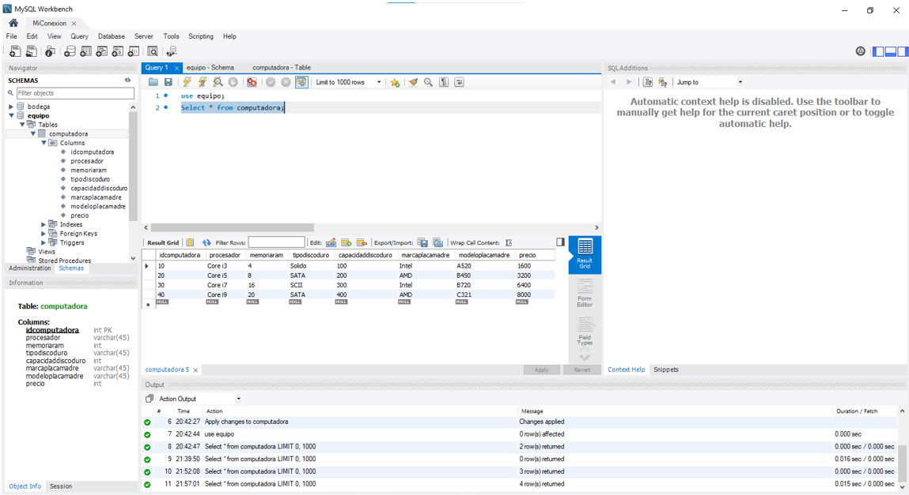
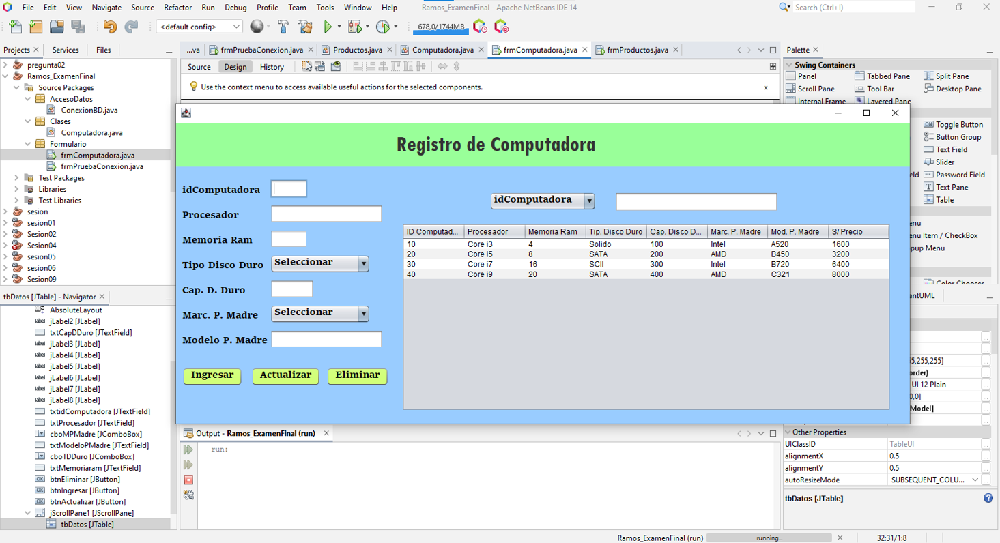

# Sistema de Registro de Computadoras
Sistema CRUD desarrollado en Java utilizando Programación Orientada a Objetos, que permite gestionar el registro de computadoras, integrando una base de datos MySQL.

---

## Tecnologías

* Java
* NetBeans
* MySQL
* JDBC
* Programación Orientada a Objetos (POO)

---

## Funcionalidades

* Registro de computadoras
* Edición de datos
* Eliminación de registros
* Listado de computadoras
* Conexión a base de datos MySQL

---

##  Base de Datos
El sistema utiliza MySQL para el almacenamiento de datos.

---

## Ejecución

1. Clonar el repositorio
2. Abrir el proyecto en NetBeans
3. Configurar la conexión a MySQL
4. Ejecutar el proyecto

---

## Capturas del Sistema

### Pantalla Principal

### Registro de Computadoras

